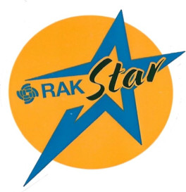

|  |  |  |    
| :-: | :-: | :-: |     

## UPDATE
This is version V2 of the tester. The test behaviour has changed, this version does everything in a loop and enables RX as well:    
Test HW ==> send 5 packets and listen to incoming packets ==> test HW ==> .....    
Output over BLE UART is enabled as well.    
It supports now 4 different hardware configurations:    
- RAK4631 High frequencies (8xx/9xx MHz)
- RAK4631 Low frequencies (433 MHz)
- RAK3401 1W tranceiver (8xx/9xx MHz)
- RAK3312 High frequencies (8xx/9xx MHz)

# WisBlock-HW-Tester
Test application to do a basic hardware test with WisBlock Base Boards, WisBlock Core RAK4631, RAK3401, RAK3312 and WisBlock modules and displays.

## Why we need a WisBlock HW tester
While doing customer support for WisBlock based devices, it is often unclear whether a problem is related to the BaseBoard, Core module or any WisBlock IO or sensor module attached.

## Origin of this WisBlock HW testers
This hardware tester application was created to make our work with the many WisBlock support request for devices running with Meshtastic firmware. As RAKwireless is not developing or maintaining the Meshtastic firmware it is often difficult to find out whether the problem is related to the WisBlock hardware or to a problem in the Meshtastic firmware.

## What is tested
This simple application is testing basic hardware functions of a WisBlock Base device:

- BaseBoard LED's 
- RAK1921 OLED display if connected
- RAK14000 EPD display if connected
- Check for connected I2C devices
- Read/Write test on the nRF52840 flash memory
- Basic LoRa transceiver check
- LoRa send and receive functionality (requires second device flashed with the tester firmware)
- Check the analog input for the battery status reading
- Check RAK12500 or RAk12501 GNSS location module if connected (and if test is done outdoors)

The results of the tests are sent over the USB port and if any display is attached, are shown on the display as well.

## How to flash the test firmware

For RAK4631/RAK3401 devices (Nordic nRF52840 based), the UF2 file can be used to flash the test firmware.      
For RAK3312, the three BIN files need to be flashed with the Espressif [ESP Flasher](https://docs.espressif.com/projects/esp-test-tools/en/latest/esp32/production_stage/tools/flash_download_tool.html) or with the CLI tool [esptool](https://github.com/espressif/esptool) (documentation [Espressif esptool](https://docs.espressif.com/projects/esptool/en/latest/esp32/))

#### Info
_**If flashing the firmware doesn't work, put the RAK3312 into BOOT mode first by pulling the BOOT pin to GND and reset or powercycle the device.**_     

### With ESP Flasher:

| Flash address | File                                       |
| ------------- | ------------------------------------------ |
| 0x0000        | WB_HW_Test_RAK3312_H_Bootloader_V2.0.0.bin |
| 0x8000        | WB_HW_Test_RAK3312_H_Partitions_V2.0.0.bin |
| 0x10000       | WB_HW_Test_RAK3312_H_V2.0.0.bin            |

### With esptool

Flash the files with

```
esptool --port [PORT] --baud 921600 --after 'hard_reset' write_flash 0x0000 WB_HW_Test_RAK3312_H_Bootloader_V2.0.0.bin 0x8000 WB_HW_Test_RAK3312_H_Partitions_V2.0.0.bin 0x10000 WB_HW_Test_RAK3312_H_V2.0.0.bin
```

_**Change [PORT] to the port number of the RAK3312 and change the files names to the correct latest files.**_

# WARNING FOR RAK3312
_**This test application is using a different partition setup. When flash back your original firmware, make sure you flash as well the correct partition file**_

----
----
# Meshtastic® is a registered trademark of Meshtastic LLC.    
Meshtastic software components are released under various licenses, see GitHub for details. No warranty is provided - use at your own risk.

# LoRa® is a registered trademark or service mark of Semtech Corporation or its affiliates. 

# LoRaWAN® is a licensed mark.

----
----